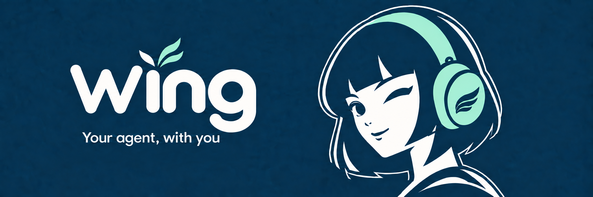
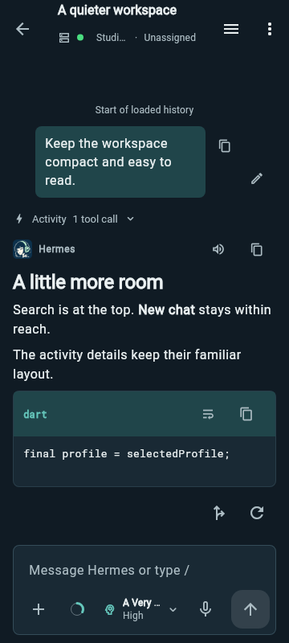
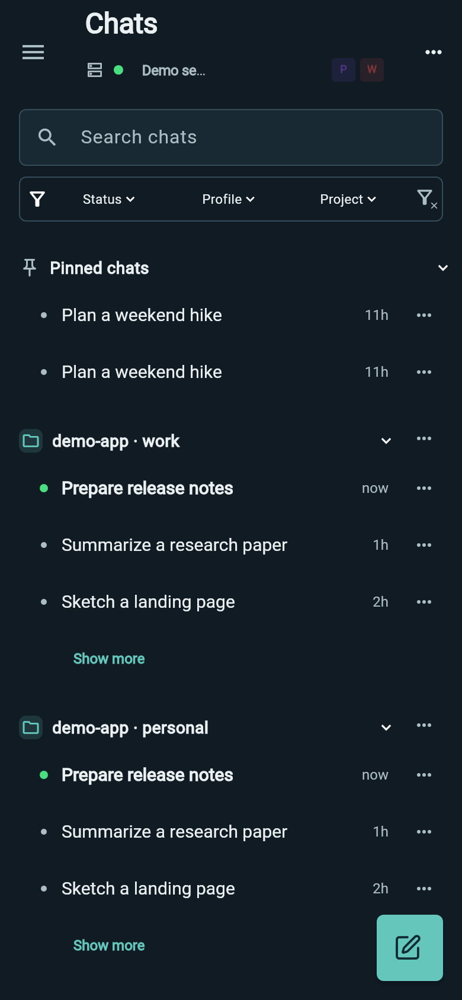
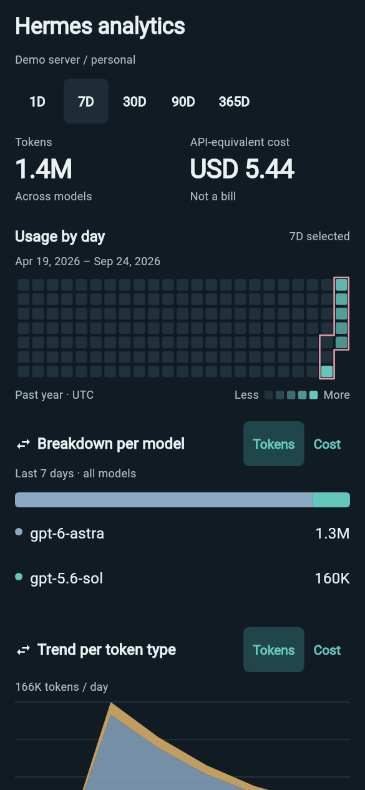
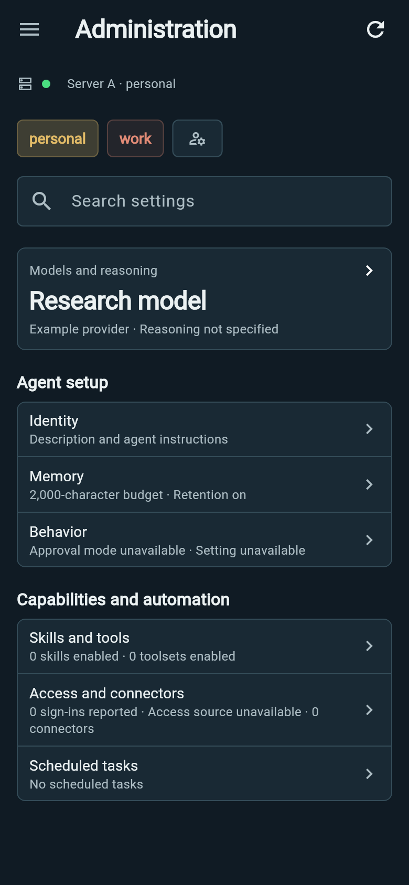
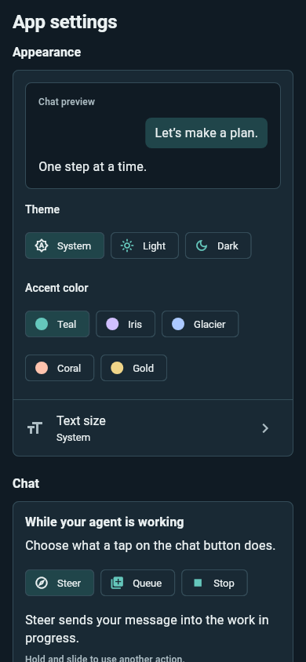
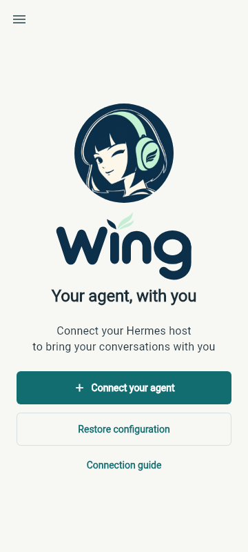

  

# Wing

**Your agent, with you**

Continue a conversation, steer running work, and send the next idea from your Android phone. Wing connects to a [Hermes Agent](https://github.com/NousResearch/hermes-agent) server that you control or have access to.

[**Download Wing for Android**](https://github.com/tarkilhk/Wing/releases/latest) · [Get started](docs/GETTING_STARTED.md) · [Explore all features](docs/FEATURES.md) · [Support Wing](#support-wing)

## See Wing in action

<table>
  <tr>
    <th>Stay in the conversation</th>
    <th>Find the right chat</th>
  </tr>
  <tr>
    <td align="center"></td>
    <td align="center"></td>
  </tr>
  <tr>
    <td>Read streaming replies, code and tool activity. Follow up without losing your place.</td>
    <td>Search, pin, group and filter conversations across profiles and projects.</td>
  </tr>
  <tr>
    <th>Understand your usage</th>
    <th>Run your Hermes setup</th>
  </tr>
  <tr>
    <td align="center"></td>
    <td align="center"></td>
  </tr>
  <tr>
    <td>Explore token trends, daily activity and model breakdowns. Cost estimates are clearly labelled.</td>
    <td>Manage profiles, models, connectors, scheduled tasks and server settings from your phone.</td>
  </tr>
  <tr>
    <th>Make it yours</th>
    <th>Get connected</th>
  </tr>
  <tr>
    <td align="center"></td>
    <td align="center"></td>
  </tr>
  <tr>
    <td>Choose a light or dark theme, accent color and text size with a live preview.</td>
    <td>Connect your Hermes dashboard or restore a saved configuration.</td>
  </tr>
</table>

## Your Hermes workflow, on your phone

- **Talk naturally.** Stream replies, inspect reasoning and tool activity, read code and tables, search within a chat, and open images, PDFs, Markdown, media and supported diagrams.
- **Stay in control.** Steer or stop work, queue a follow-up, review supported approvals, inspect subagents and goals, and return to a chat after a connection interruption. Unsent drafts and staged files survive navigation and restart.
- **Bring ideas from Android.** Attach photos and files, review content shared from another app, dictate into an editable draft, and read replies aloud. Choose on-device or Hermes speech processing separately for input and output.
- **Organize your workspace.** Switch connections and profiles, browse projects and pinned chats, filter active work, and use launcher shortcuts for Quick Chat, Activity and Search chats.
- **Operate your agent.** Manage supported profile settings, model access, MCP connectors and scheduled tasks. Check server and profile health, run diagnostics, and explore usage in Hermes analytics.
- **Keep the phone in the loop.** Get local progress, reply and approval notifications while Wing is connected. Backup or restore connection and app preferences, optionally protected with a passphrase.

Wing is an independent Android client for upstream Hermes. Features that require server support follow the capabilities of your connected Hermes version. [Explore the feature guide](docs/FEATURES.md) and [known limitations](docs/KNOWN_LIMITATIONS.md).

## Get started

1. Have a compatible Hermes dashboard and Desktop Gateway reachable from your phone. Use HTTPS or an encrypted private network for remote access.
2. Install a signed APK from the [latest release](https://github.com/tarkilhk/Wing/releases/latest). **arm64-v8a** is right for most current phones; the release also lists other architectures and checksums.
3. Follow the [setup guide](docs/GETTING_STARTED.md) to connect, choose a profile and send your first message.

Wing requires Android 7.0 or later. It does not host a model or AI service on your phone. An API key for the older Hermes API-only transport is not enough for the dashboard and Desktop Gateway connection.

## Support Wing

If Wing makes your Hermes setup more useful, you can help fund its development. Support is optional; every feature is available either way.

[**Sponsor on GitHub**](https://github.com/sponsors/tarkilhk) · [**Buy me a coffee**](https://ko-fi.com/tarkil)

## Help and contribute

Found a client problem? [Open an issue](https://github.com/tarkilhk/Wing/issues) with reproducible steps, following the [redaction guidance](SECURITY.md). The [privacy policy](PRIVACY.md) covers storage, server processing, dictation and deletion, and is available offline in App settings.

Wing is an independently developed Android client for Hermes Agent, built on the open-source work of [rusty4444](https://github.com/rusty4444) and the Hermes Android contributors. Licensed under [MIT](LICENSE). See [NOTICE.md](NOTICE.md) for credits and third-party notices.

[Contribute](CONTRIBUTING.md) · [Changelog](CHANGELOG.md) · [Documentation](docs/README.md)
