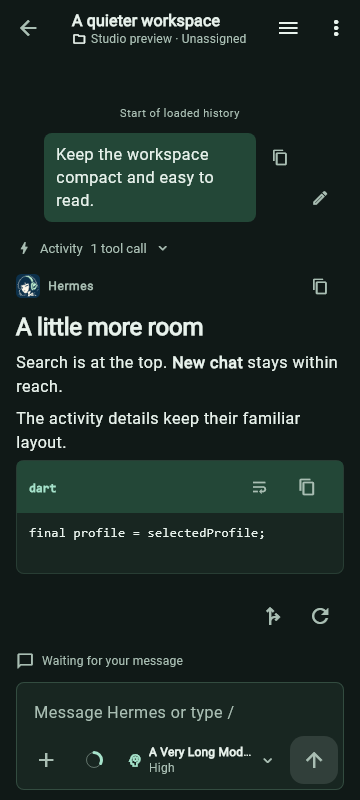
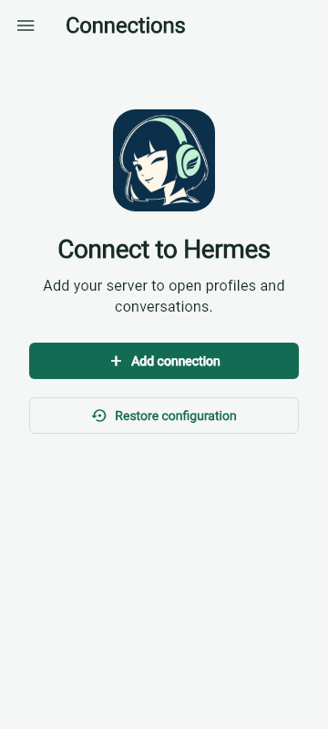

# Hermes Android

Continue conversations with your [Hermes Agent](https://github.com/NousResearch/hermes-agent) from an Android phone. Browse chats and projects, follow running work, send files, and open the results.

This is the independent `tarkilhk/hermes-android` fork, installed as **Hermes Personal**. It requires your own compatible Hermes server. It does not run a model on your phone or provide a hosted AI service.

[Getting started](docs/GETTING_STARTED.md) · [Feature guide](docs/FEATURES.md) · [Known limitations](docs/KNOWN_LIMITATIONS.md) · [Privacy](PRIVACY.md)

## What you can do

- Continue profile-owned chats with streaming replies, model/reasoning selection and searchable history.
- Organize work with projects, pinned chats, unread filters and Activity across profiles.
- Follow tool activity, subagents and goals, and respond to supported approval or clarification requests.
- Keep unsent drafts and attachments, queue follow-ups, steer a running turn, or stop it.
- Attach photos and files, dictate a draft, and review incoming Android shares before sending.
- Read and share outputs, including Markdown, images, PDFs, media and supported diagrams.
- Manage supported profile and server settings through Hermes administration.

Use the drawer for Chats, Activity, Connections, App settings and Hermes administration. Tap the context ring beside the model selector for usage details. Hold the composer arrow and slide to an available action; the normal busy action defaults to Steer and can be changed in App settings.

## Screenshots

Actual app captures from 15 September 2026. Accent colors depend on the selected theme.

| Conversation | Connections |
| --- | --- |
|  |  |

## Install and connect

1. Use Android 7.0 or newer and a Hermes host reachable from your phone.
2. Choose a signed APK from [this fork's releases](https://github.com/tarkilhk/hermes-android/releases), when available. Most current phones use the ARM64 APK. Release notes identify each published build; source changes do not imply a published APK.
3. Follow [Getting started](docs/GETTING_STARTED.md) to start the authenticated dashboard, add a connection and verify your first chat.

The modern dashboard and Desktop Gateway are required. An API key for the older API-only transport is not sufficient. Use HTTPS or an encrypted private network for remote access.

## Before relying on it

Local notifications require an active connection and do not cover every unopened chat. Queues drain only while the client is running and connected. If the app closes while sending, check server history before resending a recovered draft. See [Known limitations](docs/KNOWN_LIMITATIONS.md) for recovery and backend restrictions.

There is no offline conversation archive or general remote filesystem browser. Bots and Cron/messaging/webhook administration are outside the current scope. The [product plan](docs/PRODUCT_PLAN.md) records future work separately from delivered features.

## Development

Use Flutter 3.44.0 with its bundled Dart SDK, Java 17 and Android SDK platform 36, matching CI. From the checkout root:

```sh
flutter pub get
flutter analyze --fatal-infos
flutter test
flutter build apk --debug
```

On Windows, use the guarded launcher described in [Contributing](CONTRIBUTING.md). Run tests and Android builds sequentially. Live-server tests are opt-in and can create or change server data; read their prerequisites first.

[Contributing](CONTRIBUTING.md) covers setup, source paths and checks. [Release instructions](docs/ANDROID_RELEASE_PLAN.md) cover package identity, signing and distribution. The [documentation index](docs/README.md) separates user guides, current contracts and historical records.

## Version and application identity

[pubspec.yaml](pubspec.yaml) declares the source version. App settings shows the installed version, and [CHANGELOG.md](CHANGELOG.md) records release changes.

- Personal package: `com.tarkilhk.hermes.android`, labelled Hermes Personal.
- Development package: `com.hermesagent.hermes_android.dev`.
- The inherited upstream application is a separate package and signing identity.

## Support, privacy and provenance

Report reproducible client problems to [this fork's issues](https://github.com/tarkilhk/hermes-android/issues), using the redaction guidance in [SECURITY.md](SECURITY.md). The [privacy policy](PRIVACY.md) explains device storage, server processing, dictation and deletion. It is also available offline in App settings.

Forked from [rusty4444/hermes-android](https://github.com/rusty4444/hermes-android). Inherited contributors include CarlosReyesPena, CristianGCiocoi, AI-Guru, grunjol, louquillio and sternbergm. [NOTICE.md](NOTICE.md), the changelog and Git history preserve attribution.

License: MIT, following upstream. See [NOTICE.md](NOTICE.md) for attribution and third-party notices.
