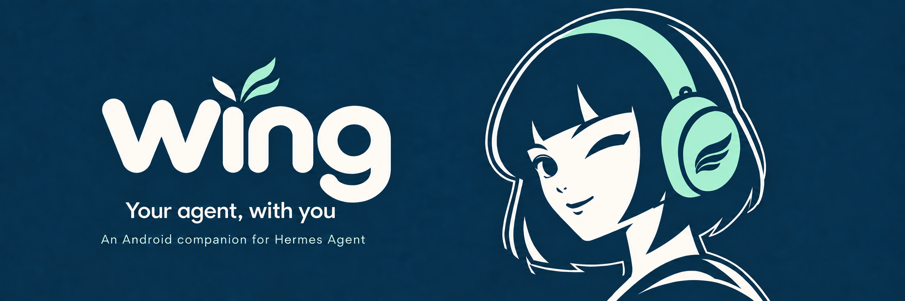
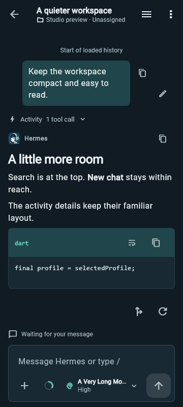
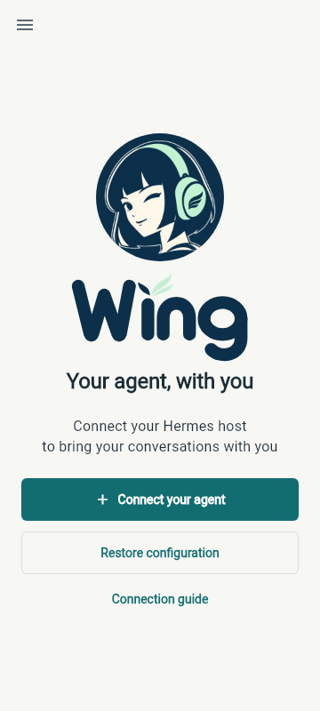

<p align="center">
  
</p>

# Wing

**Your agent, with you**

Continue conversations, check on running work, and send your next idea from your Android phone.

Wing connects to your own [Hermes Agent](https://github.com/NousResearch/hermes-agent) server. You'll need Android 7.0 or later and a compatible server to get started.

[**Download for Android**](https://github.com/tarkilhk/Wing/releases/latest) · [Setup guide](docs/GETTING_STARTED.md) · [Documentation](docs/README.md)

<a id="screenshots"></a>

## A familiar face

<table>
  <tr>
    <th>Stay with the conversation</th>
    <th>Bring your own agent</th>
  </tr>
  <tr>
    <td align="center"></td>
    <td align="center"></td>
  </tr>
  <tr>
    <td>Read replies and follow tool activity.</td>
    <td>Connect your agent or restore your configuration.</td>
  </tr>
</table>

App previews rendered from Wing's Flutter interface: conversation with sample data on 16 September 2026, welcome with the updated Wing wordmark on 17 September. Both light and dark themes are available.

## What you can do

- Continue conversations with streaming replies, searchable history, projects and pinned chats.
- Follow running work, inspect tools and subagents, and respond to supported approval requests. Queue a follow-up, steer the current turn, or stop it.
- Send photos, files and dictated ideas. Review content shared from other Android apps before sending.
- Browse results, including code, images, PDFs, media and supported diagrams. Save or share files from your phone.

[Explore the feature guide](docs/FEATURES.md)

## Get started

1. Have a compatible Hermes server reachable from your phone.
2. Install a signed APK from the [latest release](https://github.com/tarkilhk/Wing/releases/latest). Choose **arm64-v8a** for most current phones; other builds and checksums are listed with the release.
3. Follow the [setup guide](docs/GETTING_STARTED.md) to start the authenticated dashboard, add a connection and send your first message.

The modern dashboard and Desktop Gateway are required. An API key for the older API-only transport is not sufficient. Use HTTPS or an encrypted private network for remote access.

Wing is an independent client for your server, with no hosted AI service or on-device model. Read [known limitations](docs/KNOWN_LIMITATIONS.md) for connection, recovery and background-alert behavior.

## Build with us

Use Flutter 3.44.0 with its bundled Dart SDK, Java 17 and Android SDK platform 36, matching CI.

```sh
flutter pub get
flutter analyze --fatal-infos
flutter test
flutter build apk --debug
```

On Windows, use the guarded launcher in [Contributing](CONTRIBUTING.md). Run tests and Android builds sequentially. Live-server tests are opt-in and can create or change server data; read their prerequisites first.

[Contributing](CONTRIBUTING.md) · [Release instructions](docs/ANDROID_RELEASE_PLAN.md) · [Changelog](CHANGELOG.md) · [Documentation index](docs/README.md)

For design contributions, see the [Wing identity and artwork](docs/design/2026-09-15-wing-identity.md) and [Studio design system](docs/DESIGN_SYSTEM.md).

<details>
<summary>App identity and the repository name</summary>

The official name and wordmark are **Wing**, with a capital **W**. Development builds use **Wing Dev**. Package identifiers remain lowercase.

- Release package: `com.tarkilhk.wing`.
- Ordinary debug package: `com.tarkilhk.wing.dev`. Signed development builds can use the release package, as described in the [release guide](docs/ANDROID_RELEASE_PLAN.md#identity-and-versioning).
- Wing uses a new application ID with separate local data. Backups and recovery journals from the previous identity are not migrated.
- Repository: `tarkilhk/Wing`.
- Wing's package and signing identity are separate from the original Hermes Android client.

[pubspec.yaml](pubspec.yaml) declares the source version. App settings shows the installed version. Source changes do not imply a published APK.

</details>

## Support Wing

If Wing is useful in your day, you can buy me a coffee and help me keep improving it.

Completely optional. Every feature is available either way.

[Sponsor on GitHub](https://github.com/sponsors/tarkilhk) · [Buy me a coffee](https://ko-fi.com/tarkil)

## Support and provenance

Found a client problem? [Open an issue](https://github.com/tarkilhk/Wing/issues) with reproducible steps, following the [redaction guidance](SECURITY.md). The [privacy policy](PRIVACY.md) covers storage, server processing, dictation and deletion, and is available offline in App settings.

Wing is an independently developed Android companion for Hermes Agent, built on the open-source work of [rusty4444](https://github.com/rusty4444) and the Hermes Android contributors. Licensed under [MIT](LICENSE). See [NOTICE.md](NOTICE.md) for credits and third-party notices.
