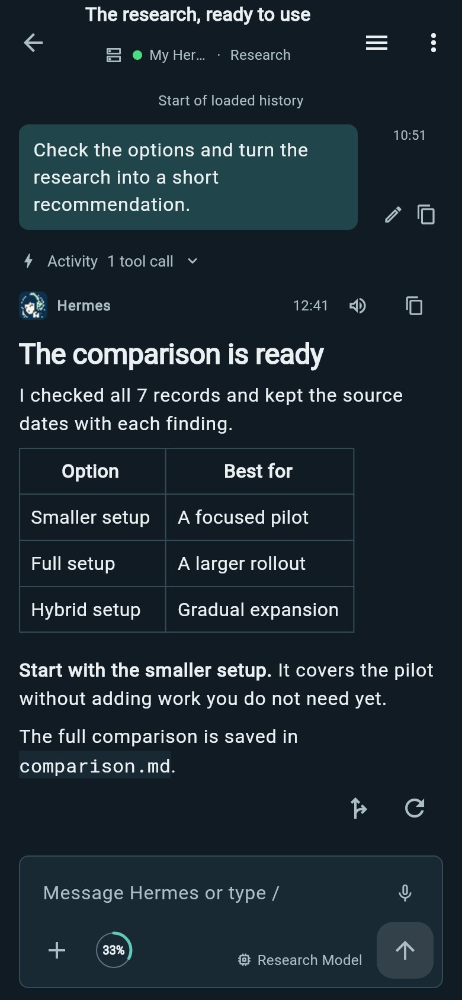
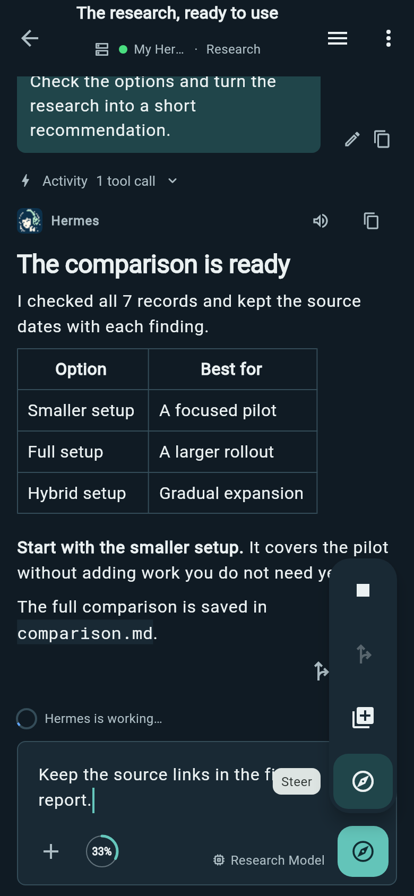

  

# Wing for Android

Wing is a free, independent, open-source Android companion for [Hermes Agent](https://github.com/NousResearch/hermes-agent). Organize work across profiles and projects, multitask through Recents, and steer the next step when you leave your desk. Your agent runs on your Hermes server; Wing brings its workspace to your phone.

[**Download Wing**](https://github.com/tarkilhk/Wing/releases/latest) · [Get connected](docs/GETTING_STARTED.md) · [Explore the features](docs/FEATURES.md)

Every feature is included without a Wing subscription. Your server and model providers may have their own costs.

**You need:** Android 7.0 or newer and a reachable Hermes server with its dashboard, Desktop Gateway and a configured model provider. [Connection guide](docs/GETTING_STARTED.md).

  
  

## What Wing does

- Keep work organized across profiles and projects. Search, pin and group conversations, then use Recents to switch between recent chats, running work and conversations that need input. Unsent drafts and attached files stay with each chat across navigation and restart.
- Follow streaming replies, tool activity, delegated tasks and available reasoning. Steer live work, queue a follow-up, or stop a run.
- Bring photos and files from Android. Dictate into an editable draft and check it before sending.
- Read formatted Markdown and tables, copy or wrap code, and preview, save or share output files. Copy whole replies or listen to them with read aloud.
- Manage supported profiles, models, identity, skills, connectors and scheduled tasks. Check host resources, server diagnostics and profile readiness in Health, and explore token usage in analytics.

[Full feature guide](docs/FEATURES.md) · [Current limitations](docs/KNOWN_LIMITATIONS.md)

## Get connected

1. Make your Hermes dashboard and Desktop Gateway reachable from your phone. Use HTTPS or an encrypted private network for remote access.
2. Install a signed APK from the [latest release](https://github.com/tarkilhk/Wing/releases/latest). Choose **arm64-v8a** for most current phones; releases list other architectures and checksums.
3. Follow the [setup guide](docs/GETTING_STARTED.md), choose a profile, and send your first message.

The [self-hosting guide](docs/SELF_HOSTING.md) covers dashboard access and proxy setup. A model-provider API key alone is not enough to connect Wing.

## Privacy and connections

The maintainer does not relay your conversations. Your chosen Hermes server and model providers process your content. [Privacy policy](PRIVACY.md).

Work accepted by Hermes can continue when your phone disconnects. Sending new messages and controlling live work need a connection. Notifications use live connections and can be interrupted by Android restrictions or network loss. [Notification guide](docs/NOTIFICATIONS.md).

[Configuration backups](docs/CONFIGURATION_BACKUPS.md) save connections, saved credentials and supported preferences, with optional passphrase encryption. Conversations stay on Hermes; drafts and queues are excluded.

This README describes the current source. Check your APK's [release notes](https://github.com/tarkilhk/Wing/releases/latest) for shipped changes.

## Support Wing

If Wing makes your Hermes setup more useful, you can help fund its development. Support is optional; every feature is available either way.

[Sponsor on GitHub](https://github.com/sponsors/tarkilhk) · [Buy me a coffee](https://ko-fi.com/tarkil)

## Help and contribute

[Report an issue](https://github.com/tarkilhk/Wing/issues) with reproducible steps, following the [redaction guidance](SECURITY.md).

Wing builds on the open-source work of [rusty4444](https://github.com/rusty4444) and the Hermes Android contributors. Licensed under [MIT](LICENSE). See [NOTICE.md](NOTICE.md) for credits and third-party notices.

[Contribute](CONTRIBUTING.md) · [Changelog](CHANGELOG.md) · [Documentation](docs/README.md)
