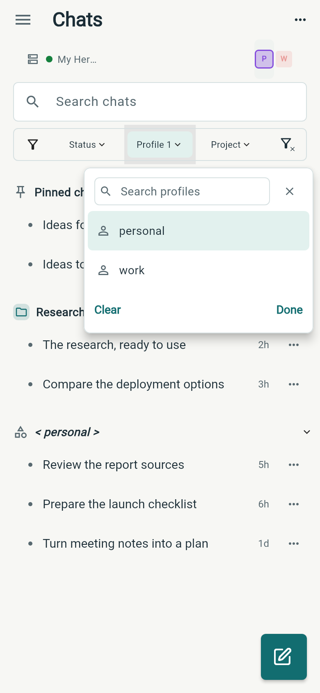
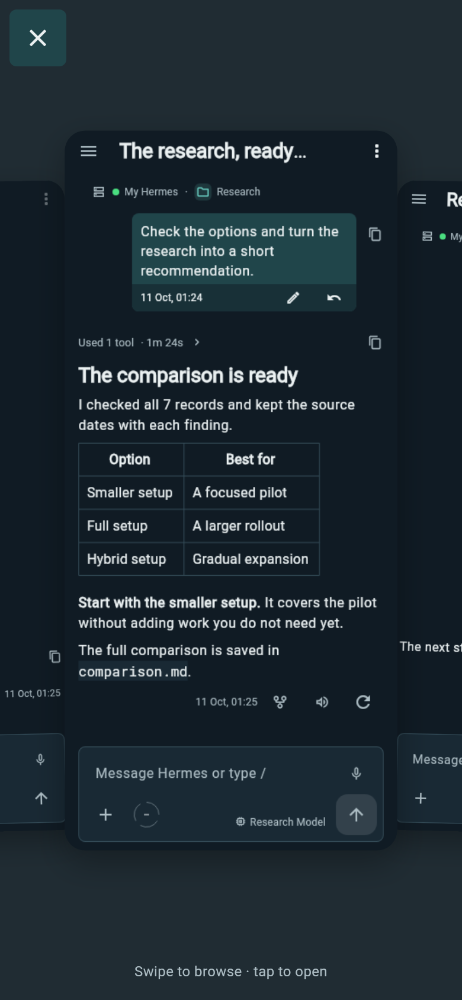
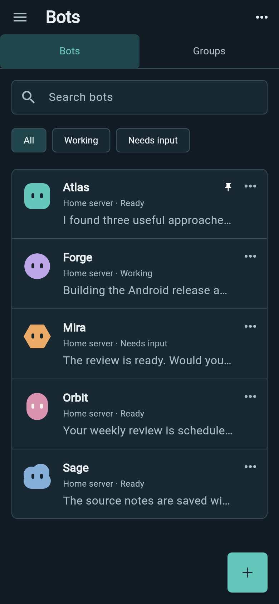
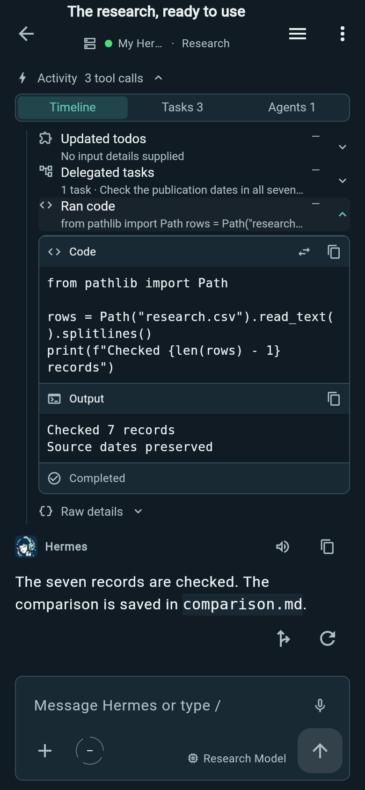
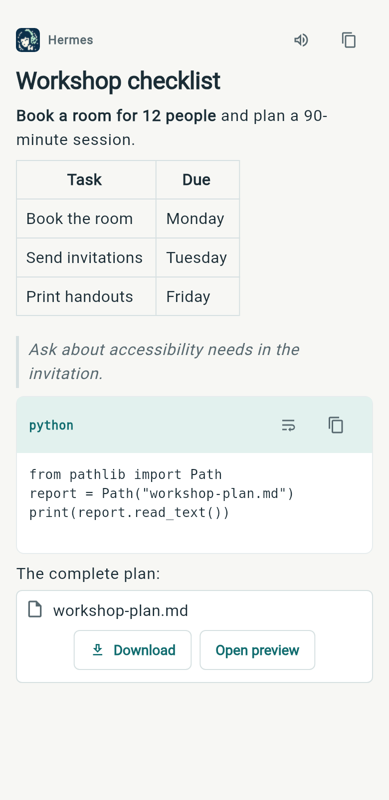
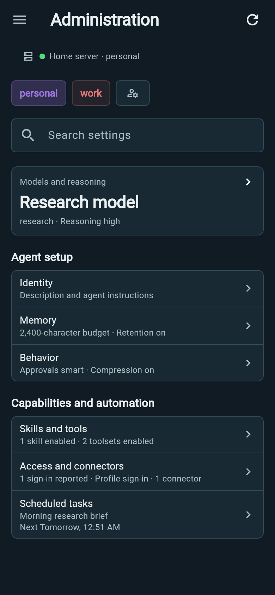
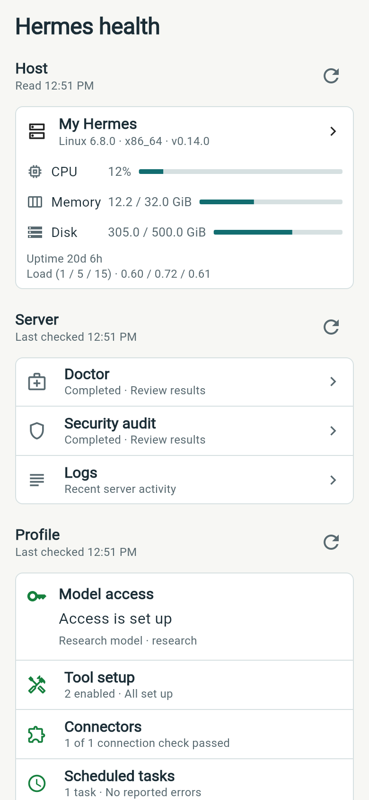

  

# Wing for Android

Wing is an open-source Android companion for [Hermes Agent](https://github.com/NousResearch/hermes-agent). Work with your agent from your phone while it runs on your server.

[**Download Wing**](https://github.com/tarkilhk/Wing/releases/latest) · [**Explore Wing**](https://tarkilhk.github.io/Wing/)

Requires Android 7.0 or newer and a Hermes server you can reach from your phone.

## Switch between profiles and projects

Tap a profile to focus its chats, or combine profiles in one view. Choose projects, group and sort conversations, and select the details you want to see. Wing remembers your view for each connection.

  

[Profile switching and view controls](https://tarkilhk.github.io/Wing/workspaces.html)

## Multitask with Recents

Find running chats and conversations waiting for your input across profiles. In a chat opened from Recents, swipe sideways with two fingers to switch, or pinch into a card stack and tap another conversation.

  

[Explore Recents and gestures](https://tarkilhk.github.io/Wing/recents.html)

## Manage your bots

Find bots across your saved connections and return to each bot's continuing chat. Pin the bots you use most, filter by Working or Needs input, and give each one a distinct name and appearance.

  

[Explore Bots](https://tarkilhk.github.io/Wing/bots.html)

## Live work

Inspect tool calls, reasoning, tasks and delegated agents, then steer or stop a run, queue a follow-up, or fork from a selected saved answer. Choose a skill while composing a message. Open skills in the chat to read their instructions.

  

[Explore live work](https://tarkilhk.github.io/Wing/live-work.html)

## Answers and files

Read formatted Markdown, wide tables and highlighted source code. Copy code or whole replies, listen to answers, and preview, save or share output files. Edit an earlier sent message, or restore its checkpoint to remove later history and rerun that prompt.

  

[Explore answers and files](https://tarkilhk.github.io/Wing/results.html)

## Administration

Manage models, instructions, skills, connectors and scheduled tasks for each profile.

  

[Explore Administration](https://tarkilhk.github.io/Wing/administration.html)

## Health

Check host resources, backend diagnostics and profiles. Set alerts for resource pressure or profile problems, then inspect notifications from any screen. Checks run while Wing is open or monitoring ongoing work.

  

[Explore Health](https://tarkilhk.github.io/Wing/health.html)

## Analytics

Compare activity and token usage across profiles, models and time periods.

  

[Explore Analytics](https://tarkilhk.github.io/Wing/usage.html)

## Install and connect

1. Download the signed APK from the [latest release](https://github.com/tarkilhk/Wing/releases/latest). Choose **arm64-v8a** for most current phones.
2. Follow the [connection guide](https://tarkilhk.github.io/Wing/get-started.html) to connect your Hermes dashboard and Desktop Gateway, choose a profile and send your first message.

For server and proxy configuration, see [self-hosting](docs/SELF_HOSTING.md). Your Hermes setup needs a configured model provider; your server and providers may have their own costs.

## Help and contribute

[Report an issue](https://github.com/tarkilhk/Wing/issues) · [Contributing](CONTRIBUTING.md) · [User guides](docs/README.md) · [Changelog](CHANGELOG.md) · [Security](SECURITY.md) · [Privacy](PRIVACY.md)

## Support Wing

[Sponsor on GitHub](https://github.com/sponsors/tarkilhk) · [Buy me a coffee](https://ko-fi.com/tarkil)

[MIT license](LICENSE) · [Third-party notices](NOTICE.md)
