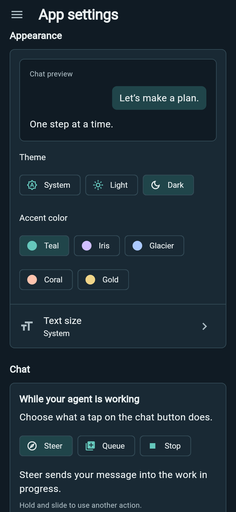
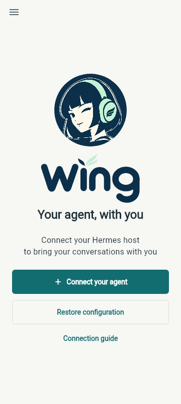

  

# Wing

**Your agent, with you**

Wing is an independent, open-source Android app for [Hermes Agent](https://github.com/NousResearch/hermes-agent). Pick up a conversation, check what your agent is doing, and send the next idea when you step away from your desk. Your agent runs on your Hermes server; Wing brings its conversations and controls to your phone.

[**Download Wing for Android**](https://github.com/tarkilhk/Wing/releases/latest) · [Get started](docs/GETTING_STARTED.md) · [Explore Wing](docs/FEATURES.md) · [Support Wing](#support-wing)

**You need:** Android 7.0 or newer and access to a Hermes server with its dashboard, Desktop Gateway and a configured model provider. [Connection guide](docs/GETTING_STARTED.md).

## Your Hermes workflow, on your phone

- **Pick up where you left off.** Find conversations across connections, profiles and projects. Search, pin and group chats, or use Recents to catch up on recent and ongoing work.
- **Keep work moving.** Follow streaming replies, available reasoning and tool activity. Steer or stop a running chat, queue the next instruction, review supported approvals, and inspect subagents and goals.
- **Bring ideas from Android.** Attach photos and files, take a picture, or review content shared from another app. Dictate into an editable draft and read replies aloud, with separate on-device or Hermes voice choices.
- **Use the results.** Read code and tables, search within a chat, and preview images, PDFs, Markdown, HTML reports, supported diagrams and media. Save or share output files through Android.
- **Look after your agent.** Manage supported profiles, models, provider access, MCP connectors and scheduled tasks. Check health, run diagnostics, and explore activity and token usage in Hermes analytics.
- **Make it yours.** Choose light or dark themes, accent colors and text size. Keep unsent drafts and staged files across navigation and restart, and back up connections and app preferences.

Wing is free to use, with every feature available without a Wing subscription. It connects to your chosen Hermes server; the maintainer does not relay your conversations. Your server and model providers handle the content you send and any service charges. [Privacy policy](PRIVACY.md).

[Explore the full feature guide](docs/FEATURES.md) · [Good to know before you start](docs/KNOWN_LIMITATIONS.md)

## See Wing in action

<table>
  <tr>
    <th>Stay in the conversation</th>
    <th>Find the right chat</th>
  </tr>
  <tr>
    <td align="center"></td>
    <td align="center"></td>
  </tr>
  <tr>
    <td>Read streaming replies, code and tool activity. Follow up without losing your place.</td>
    <td>Search, pin, group and filter conversations across profiles and projects.</td>
  </tr>
  <tr>
    <th>Understand your usage</th>
    <th>Run your Hermes setup</th>
  </tr>
  <tr>
    <td align="center"></td>
    <td align="center"></td>
  </tr>
  <tr>
    <td>Explore token trends, daily activity and model breakdowns. Cost estimates are clearly labelled.</td>
    <td>Manage profiles, models, connectors, scheduled tasks and server settings from your phone.</td>
  </tr>
  <tr>
    <th>Make it yours</th>
    <th>Get connected</th>
  </tr>
  <tr>
    <td align="center"></td>
    <td align="center"></td>
  </tr>
  <tr>
    <td>Choose a light or dark theme, accent color and text size with a live preview.</td>
    <td>Connect your Hermes dashboard or restore a saved configuration.</td>
  </tr>
</table>

## Get started

1. Have a compatible Hermes dashboard and Desktop Gateway reachable from your phone. Use HTTPS or an encrypted private network for remote access.
2. Install a signed APK from the [latest release](https://github.com/tarkilhk/Wing/releases/latest). **arm64-v8a** is right for most current phones; the release also lists other architectures and checksums.
3. Follow the [setup guide](docs/GETTING_STARTED.md) to connect, choose a profile and send your first message.

The [self-hosting guide](docs/SELF_HOSTING.md) covers dashboard access and proxy setup. A model-provider API key alone does not establish Wing's dashboard and Desktop Gateway connection.

## Connections, notifications and backups

- **Your agent works on the server.** Work already accepted by Hermes can continue when your phone disconnects. Sending new messages and controlling live work need a connection; some recent chats remain available for offline reading.
- **Alerts come from live connections.** Wing can notify you about replies and input requests while you use other apps. Android background restrictions, force-stop and network loss can interrupt delivery. [Notification setup](docs/NOTIFICATIONS.md).
- **Backups save configuration.** Exports include connections, saved credentials and supported app preferences, with optional passphrase encryption. Conversations stay on Hermes; drafts and queues are excluded. [Backup details](docs/CONFIGURATION_BACKUPS.md).

This page describes the current source. For changes available in a downloaded APK, check its [release notes](https://github.com/tarkilhk/Wing/releases/latest).

## Support Wing

If Wing makes your Hermes setup more useful, you can help fund its development. Support is optional; every feature is available either way.

[**Sponsor on GitHub**](https://github.com/sponsors/tarkilhk) · [**Buy me a coffee**](https://ko-fi.com/tarkil)

## Help and contribute

Found a client problem? [Open an issue](https://github.com/tarkilhk/Wing/issues) with reproducible steps, following the [redaction guidance](SECURITY.md). The [privacy policy](PRIVACY.md) covers storage, server processing, dictation and deletion, and is available offline in App settings.

Wing is an independently developed Android client for Hermes Agent, built on the open-source work of [rusty4444](https://github.com/rusty4444) and the Hermes Android contributors. Licensed under [MIT](LICENSE). See [NOTICE.md](NOTICE.md) for credits and third-party notices.

[Contribute](CONTRIBUTING.md) · [Changelog](CHANGELOG.md) · [Documentation](docs/README.md)
