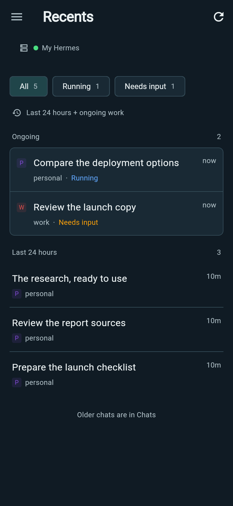

  

# Wing for Android

Wing is a free, open-source Android app for [Hermes Agent](https://github.com/NousResearch/hermes-agent). Your agent runs on your server; Wing lets you work with it from your phone.

[**Download Wing**](https://github.com/tarkilhk/Wing/releases/latest) · [Website](https://tarkilhk.github.io/Wing/) · [Get connected](https://tarkilhk.github.io/Wing/get-started.html)

Switch profiles with a tap and choose projects across profiles. [Group, filter and sort your chats](https://tarkilhk.github.io/Wing/workspaces.html); Wing remembers your view for each connection. Recents brings running chats and conversations waiting for your input together across profiles. Drafts stay with their chats when you switch screens.

  
  

- Inspect tool calls, tasks and delegated agents. Steer or stop a run, edit a queued follow-up, or fork a new chat from a saved answer. [Live work](https://tarkilhk.github.io/Wing/live-work.html).
- Read Markdown and wide tables, copy code or whole replies, listen to answers, and preview, save or share files. [Results](https://tarkilhk.github.io/Wing/results.html).
- Check host resources and diagnose server or profile problems in [Health](https://tarkilhk.github.io/Wing/health.html). Change models, instructions, skills, connectors and scheduled tasks in [Administration](https://tarkilhk.github.io/Wing/administration.html).
- Compare activity and token usage by profile, model and period in [Analytics](https://tarkilhk.github.io/Wing/usage.html).

## Install and connect

Requires Android 7.0 or newer and a reachable Hermes setup with its dashboard, Desktop Gateway and a configured model provider. Your server and model providers may have their own costs.

Install the signed **arm64-v8a** APK for most current phones. Connect through Hermes Cloud or enter your server's dashboard address. The [connection guide](https://tarkilhk.github.io/Wing/get-started.html) walks through setup and failed checks; the [self-hosting guide](docs/SELF_HOSTING.md) covers server and proxy configuration.

## Help and contribute

[Report an issue](https://github.com/tarkilhk/Wing/issues) · [Contributing](CONTRIBUTING.md) · [Security](SECURITY.md) · [Privacy](PRIVACY.md) · [Changelog](CHANGELOG.md) · [Technical documentation](docs/README.md)

## Support Wing

[Sponsor on GitHub](https://github.com/sponsors/tarkilhk) · [Buy me a coffee](https://ko-fi.com/tarkil)

[MIT license](LICENSE) · [Third-party notices](NOTICE.md)
