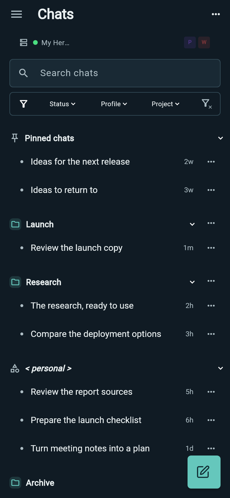
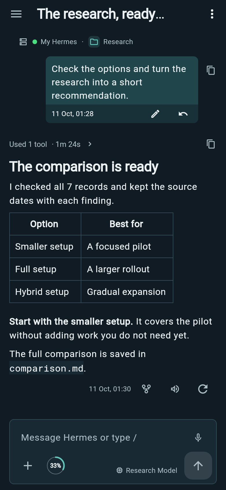
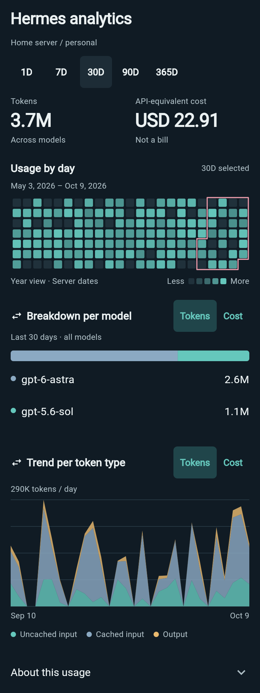
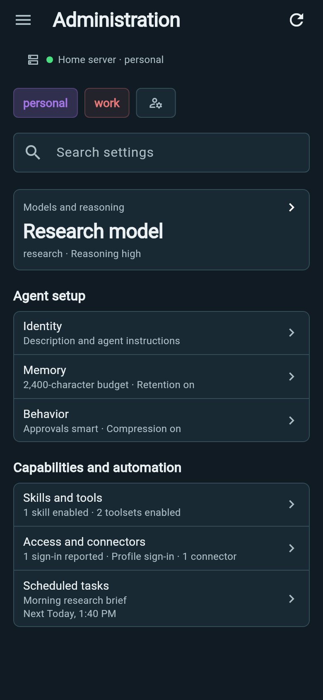

# Explore Wing

**Your agent, with you.** Wing keeps Hermes close when you step away from your desk. Start a conversation, check progress, send the next idea and look after your setup from Android. [Get started](GETTING_STARTED.md).

## Pick up where you left off

  
  

- **Find the right chat.** Search, pin and group conversations; filter by profile, project or status. The Project filter lists projects and unassigned-chat groups belonging to the selected profiles; clear the Profile filter to see all profiles' projects. Recents shows chats with messages from the last 24 hours alongside ongoing work, with All, Running and Needs input filters. Inside a chat opened from Recents, swipe sideways with two fingers to switch. Pinch inward to keep a card stack open, swipe through it and tap a card to open. Soft edge cues indicate replies (white in dark mode, charcoal in light mode) or confirmed requests for input (amber). Back closes the stack, then returns to your Recents filter.
- **Keep browsing after changes.** Chat and project actions apply when Hermes confirms them. The list then refreshes in the background, keeping search, token counts and reading position available. Progress and Retry stay above the scrolling list; retrying a refresh does not repeat the action.
- **Read the whole story.** Follow streamed replies, code, tables, tool activity and available reasoning. Python, shell commands and other identified source languages have syntax coloring in chat, Activity and file previews, with exact selection/copy and wrapping. Use the wrap icon beside Copy to switch code between wrapped lines and horizontal scrolling, including in the full Activity code viewer. Large and dense source blocks color within the visible viewport. Live code stays plain until the response finishes; unsupported or unlabelled source stays plain, and coloring failures preserve readable text. Find a message in a chat, open a result, or return to the latest reply.
- **Understand each action.** Open Activity → Timeline for readable call titles,
  targets, exception notices and available timings, with native reasoning between calls. Expand a call for its request
  and reported result: code/output, file content, Find/Replace and returned diffs,
  images/questions, search matches or readable tool data. Icon actions copy exact
  text, preview or share files/images, expand long previews, open a full view and wrap code; explanation text
  supports Markdown. Raw details retains selectable, copyable inputs and output.
  Skill-update batches show each operation's action, affected file when supplied
  and reported success.
  Live elapsed counters start only from a backend tool start; saved timing appears
  only when available. See [tool activity](TOOL_ACTIVITY.md).
- **Stay oriented.** See the selected model, context percentage inside its ring and current work. While Hermes compresses the conversation, the status above the composer shows “Summarizing conversation…” until work resumes or compression finishes. Tap the ring for a compact breakdown of used/max tokens, estimated context categories and available compression count. Switch models with a clear confirmation when Hermes warns about the change.

## Keep work moving

- **Talk to your bots.** Open Bots in the side menu for a compact roster across saved instances. Switch between Bots and Groups, keep pinned rows at the top, and see the last message from each bot's continuing chat. Tap its name or preview to chat, or its avatar to edit name and appearance. Valid appearance edits save automatically. The row menu offers View screen, Pin/Unpin, Hide/Show and Bot settings; settings opens role, instructions, model, accounts and tool editors, plus duplication and advanced profile management. Hosted Discussion groups bring 2–6 bots from one ready instance together, with mentions, approvals, stop and recovery controls. [Bots and current desktop differences](BOTS.md).

- **Choose your model.** Browse a compact provider-filtered list and open model cards for supplied prices and account usage. OpenAI API and Codex choices share models.dev API rates; Codex labels them as API-equivalent. Account usage retains each account's reported windows. The small brain control selects reasoning; lightning toggles fast mode where available. In the composer, tap the short model name to open the picker, tap lightning to toggle fast, or hold thinking, slide to a level and release to apply; slide away to cancel. Picker changes wait for Apply.
- **Choose what happens next.** Send a new message, steer active work, queue a follow-up or stop it. An empty composer shows Stop while work is running; start typing to restore the send arrow and your usual held-action order. Hold, slide and release to choose another action. Edit a queued item before it sends. Drafts and staged files survive navigation and restart.
- **Use a skill while writing.** Type `/` after a space or on a new line anywhere in your message to open the skill helper. Pick a skill to insert its name in bold accent text. Keep writing, then Send to load its instructions with your message.
- **Explore another direction.** User messages sit at the right with time and actions in a compact tinted footer. Edit a saved message, or use Restore in its footer to confirm removal of later history and rerun that prompt. Restore preserves your separate draft and pauses queued follow-ups. Fork from a selected saved answer into a separate conversation, or regenerate it in place. Fork is not a send-menu choice. Your Hermes server keeps the authoritative history.
- **Follow delegated work.** In Activity → Tasks, read full task text with explicit status and subtask indentation. In Agents, see each goal, current activity and available timing; tap for live output, backend details and supported controls. Saved task and delegation results restore these tabs in past chats; historical agents expose output and delivered durations without live controls.
- **Respond from your phone.** Review supported approvals and questions, inspect subagents and goals, and use local notifications for replies and requests while Wing is running.

## Use what is already on your phone

- **Bring files and ideas.** Attach a photo or file, take a picture inside a chat, or review content shared from another Android app before sending it to Hermes.
- **Open useful results.** Images appear inline in replies, with a compact download control and tap-to-zoom using the original. Preview PDFs, Markdown, diagrams and supported media. File cards place a download arrow and preview eye beside the filename. Save or share output files through Android.
- **Talk when typing is awkward.** Dictate into an editable draft and read a reply aloud. Choose on-device or Hermes processing separately for input and output in App settings.

## Run your Hermes setup

  
  

Switch between connections and profiles. Manage supported model settings, provider access, MCP connectors and server-run scheduled tasks. Health and diagnostics help you find setup problems; analytics shows activity, tokens and model breakdowns. Supported controls depend on your Hermes server and profile.

The title-row bell warns about issues affecting Hermes while Wing is open or
already monitoring work. Tap it for one issue at a time. Configure device-local
thresholds under **Hermes health → Alert settings**; RAM and disk warnings start
above 90% for two minutes and clear below 85% for two minutes. Valid settings
save automatically. Separate native-pressure toggles admit Hermes's critical
memory and disk reports immediately. [Health alerts](ADMINISTRATION.md#health-alerts)
explains recovery and investigation. Closing the alert dialog leaves unresolved
issues visible in the bell; there are no acknowledgement or snooze controls.

## Make it yours

Choose a light or dark theme, accent color and text size with a live preview. Back up your connections and app preferences, with an optional passphrase. Quick Chat, Recents and Search chats are also available from Wing's Android launcher shortcut menu.

[Get started](GETTING_STARTED.md) · [Good to know](KNOWN_LIMITATIONS.md) · [All guides](README.md)
