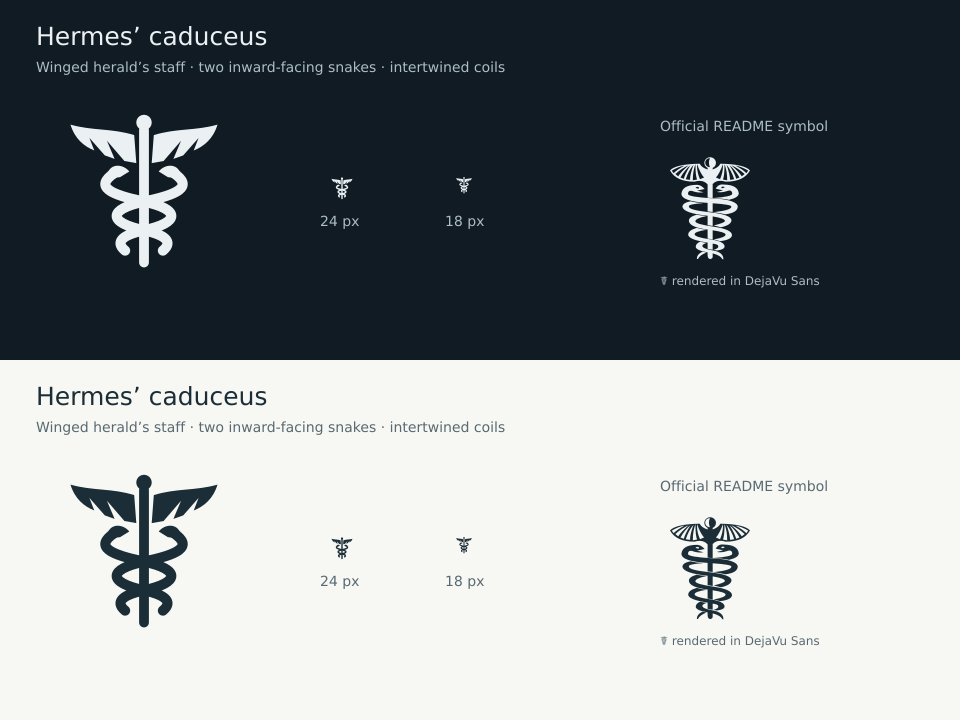

# App icon and portrait assets

The app is now named Wing. The [approved Wing identity](2026-09-15-wing-identity.md)
extends these production assets with the title-case **Wing** wordmark and pointed feather
accents. The portrait and launcher/notification export rules below remain current.

The selected Playful portrait has a wink, simple dark bob, mint headphones and a three-part messenger wing. The normal launcher uses the portrait. Chat notifications and optional Android themed icons use the white wing with Android-supplied tint. The permanent connection indicator uses its own monochrome connection glyph.

Brand colors are navy `#0C304A`, cream `#FFF9EB` and mint `#C6EED5`. Keep the original artwork in both themes. These are identity colors, separate from the [screen tokens](../DESIGN_SYSTEM.md).

## Production sources

| File | Purpose |
| --- | --- |
| [playful-master.png](../../assets/icon/playful-master.png) | Portrait master with navy matte |
| [wing.svg](../../assets/icon/wing.svg) | Scalable notification and themed-icon wing |
| [ic_stat_connection.xml](../../android/app/src/main/res/drawable/ic_stat_connection.xml) | Native vector source for the permanent connection indicator |
| [icon.png](../../assets/icon/icon.png) | 1024 px launcher/store composition |
| [generate-app-icons.cjs](../../scripts/generate-app-icons.cjs) | Density, store and native vector exports |
| [generate-notification-board.py](../../scripts/generate-notification-board.py) | Exact native vectors in the approved notification identity board |

Run `node scripts/generate-app-icons.cjs` with Node.js and `sharp` available locally or through `NODE_PATH`. It exports the checked-in sources without remote generation.

Adaptive layers are 108 dp, with the portrait occupying about 62 dp after padding. The central 72 dp viewport supplies legacy/store composition. The foreground includes its navy matte, with no baked-in rounded tile or shadow; Android applies the adaptive mask. Legacy PNGs have rounded corners.

`ic_stat_wing` is a 24 dp white alpha vector. The notification sink selects it by drawable name, and `res/raw/keep.xml` retains it during resource shrinking. API 33 adds the wing monochrome layer; API 26 keeps the regular portrait. Round and ordinary adaptive icons share a foreground.

`ic_stat_connection` is a separate 24 dp white alpha vector referenced directly
by `BackgroundMonitoringService`. Its XML is the source asset; the launcher
export script does not overwrite it. Keep it distinguishable from the chat wing
at 18 and 24 px, with Android-supplied tint on both light and dark backgrounds.

### Hermes caduceus connection icon

On 16 September 2026, the owner directed the designer to base the connection
icon on Hermes' caduceus. The [official Hermes Agent README](https://github.com/NousResearch/hermes-agent)
uses the caduceus symbol ☤. Preserve the recognizable outspread wings,
straight staff, and two intertwined snakes with distinct heads. Studio governs
the restrained monochrome finish and small-size clarity.

The owner approved the final caduceus for permanent connection and the existing
wing for each chat notification. Both appear together in the
[notification identity board](2026-09-15-wing-identity.md#notification-identity-board).

Keep the wings, snake heads and winding bodies legible at small sizes.
The glyph uses white alpha only; Android supplies its displayed
tint. It does not change shape to claim connection health.

This proof renders the vector geometry directly. It verifies the icon's shape
and small-size separation, not Android's final status-bar layout.

## In-app placements

Use the shared `PlayfulPortrait` widget, decoded for the display's pixel density, in these five approved positions:

| Location | Size |
| --- | --- |
| Drawer header | 48 dp |
| Installed-app version card | 48 dp |
| Empty chat greeting | 104 dp |
| First connection | 144 dp, circular |
| Assistant author badge | 24 dp |

Treat the portrait as decorative beside existing labels. Preserve message width and the author row; do not add an avatar column. The empty greeting is scrollable and yields to history loading, errors, messages or active work.

The [design system](../DESIGN_SYSTEM.md) describes the native navy splash and first-connection composition.

## Verification after asset changes

Inspect the generated [production proof](images/icon-production-proof.png), including circle/rounded masks and 18/24 px wing rendering in light and dark. Preserve the visible wink and earcup emblem. Run the launcher/notification contract tests, inspect packaged resources, and check the actual launcher and notification shade. A debug build does not verify optimized resource retention or optional themed-icon behavior.

The [README](../../README.md#see-wing-in-action) shows Wing's interface. Superseded expression boards and deployment journals remain in Git history.
