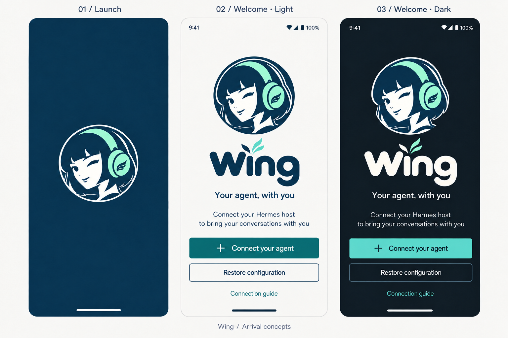
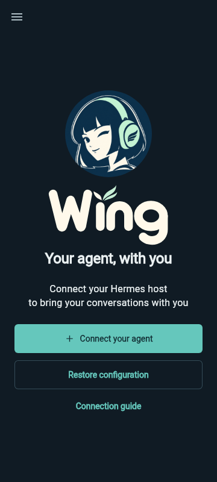

# Wing arrival screens

Approved on 15 September 2026, extending the [identity](2026-09-15-wing-identity.md)
and [Studio design system](../DESIGN_SYSTEM.md).

The owner requested the capital-W **Wing** wordmark on 17 September 2026.
The concept board and widget renders below use that spelling.

## Selected concept

## Implementation

- Native Android startup shows the existing portrait on brand navy `#0C304A`.
  Android 12 and newer use explicit platform splash attributes with the adaptive
  launcher portrait. Older supported versions use a centered portrait drawable.
  Status and navigation bars match navy during launch. There is no forced wait,
  spinner, additional splash route or dependency on the server becoming ready.
- With no saved connections, `WingWelcome` shows the original portrait in a
  144 dp circle, a 200 dp scalable `WingWordmark`, and “Your agent, with you”.
  Brand copy has no terminal periods. Other portrait placements are unchanged.
- The primary Connect your agent action invokes the existing connection dialog.
  Restore configuration invokes the existing passphrase-protected import flow.
  The drawer remains reachable, including App settings and its theme controls.
- Connection guide opens a bundled native screen that works offline and offers
  a link to the full setup documentation. It does not perform server operations.
- The layout centers within the available area, caps content width at 400 dp
  and scrolls when text scaling or screen height requires it. Action targets are
  at least 48 dp tall and can grow to fit labels. Studio theme tokens control
  the canvas, body text, buttons, borders and focus states. Artwork retains the
  original navy, cream and mint palette.
- Saved connections, automatic workspace opening, incoming-share review and
  restore state remain owned by `HomeScreen`. No new onboarding flag or storage
  migration is introduced.

## Actual widget renders

These are renders of the implemented Flutter widgets using the existing Studio
render harness, not photographs or screenshots of an installed Android app.
Native system bars and the Android splash require separate platform checks.

| Light | Dark |
| --- | --- |
|  |  |

The welcome tests exercise both themes at 320 × 560 with normal and doubled
text, connection/restore callbacks, and offline guide navigation. Existing
connection, restore, sharing, drawer and text-preference tests cover the
integration with the app shell. The Studio render harness also checks welcome
layouts at 360 dp and 320 dp widths.
