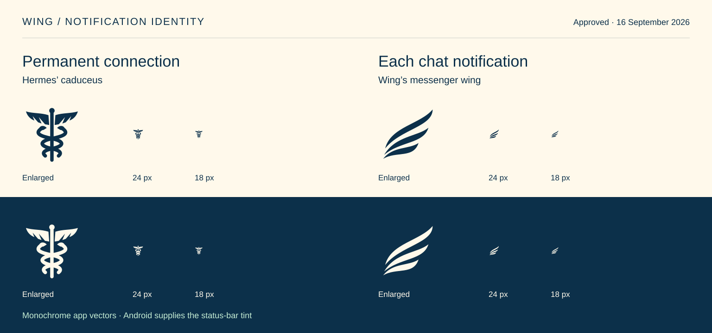

# Wing identity

Selected by the owner on 15 September 2026, with official **Wing** capitalization
requested on 17 September 2026. This is the selected identity within the
[Studio design system](../DESIGN_SYSTEM.md).

## Notification identity board

Approved by the owner on 16 September 2026: **Hermes' caduceus for the permanent
connection**, and **the messenger wing for each chat notification**.

This addition to the identity board renders the exact app vectors. Regenerate it
with `python3 scripts/generate-notification-board.py`. Android supplies the tint;
the light and dark specimens show the approved silhouettes at 18 and 24 px.
The [production asset record](2026-09-14-app-icon.md#hermes-caduceus-connection-icon)
owns the source paths and Android usage.

## Name and wordmark

- Write **Wing** in prose, app titles, launcher labels, store listings and accessibility labels. Use **Wing Dev** for development builds.
- The drawn wordmark reads **Wing**: capital **W**, lowercase **ing**, with rounded letters. Use the owner's approved [slimmer-W banner](images/wing-readme-hero-slim-w.png) as the lettering reference. The W rises only modestly above the lowercase bodies; its slimmer diagonal strokes give it the same optical weight as ing. Keep its open internal spaces and avoid a heavier, fatter or oversized initial. The W is a letter, not a rotated or crossed wing symbol. This owner selection of 17 September 2026 supersedes the earlier wordmark treatments.
- In the Flutter vector wordmark, use the same 36-unit stroke for every letter. The owner rejected the thinner W in the welcome-screen screenshots. Keep the modest capital height and the selected banner; do not thin the production W separately.
- Above the i, use three solid, curved, pointed feather shapes derived from the original single-wing emblem. One small feather points up-left; two point up-right. The left feather is navy on cream and cream on navy. The two right feathers are mint.
- Use the compact accent proportions in this board. The final refinement requested an approximately 18% reduction from the previous cluster and slightly tighter gaps. The accepted image is the visual reference; that percentage is an editing direction, not a measured vector specification.
- Keep visible gaps between feathers and above the i stem. The word should read before the accent draws attention.

## Supporting artwork

Use the same pointed feather silhouettes in standalone graphic elements and
enlarged decorations. The old round-ended splash/droplet accents are retired.
The graphic-element specimen uses the same one-left, two-right arrangement;
the splash card uses the two mint feathers enlarged. Preserve text clearance.

Keep the selected winking portrait, dark bob, mint headphones and original
single-wing earcup emblem. The normal launcher uses the portrait; chat alerts
and optional themed icons use the existing single wing. The permanent connection
indicator uses Hermes' caduceus as a separate monochrome glyph, as directed by
the owner on 16 September 2026. See the
[production asset record](2026-09-14-app-icon.md).

| Brand color | Value |
| --- | --- |
| Navy | `#0C304A` |
| Cream | `#FFF9EB` |
| Mint | `#C6EED5` |

These colors belong to the artwork. Studio screen tokens and user accent
preferences continue to govern controls. Rounded lettering and circular portrait
masks remain part of the identity. Use **Wing** for brand-board headings and
product references. “Your agent, with you” is the selected
tagline, and “A familiar face” is supporting copy. Omit terminal periods from
brand-card and banner copy. Retain the comma in the tagline.

## Source and implementation boundary

The checked-in [board](images/wing-identity-board.png) is the approved raster
design reference for the capital-W identity and feather accent.
The board does not identify a verified font family. The
[WingWordmark](../../lib/core/widgets/wing_wordmark.dart) widget now provides
scalable drawn lettering and feather paths for the approved arrival screens.
Preserve this lettering rather than substituting a guessed font. Other
production screen text keeps Studio typography.

This change adopts the name and saves the visual framework. It does not insert
the entire board into the app or replace existing launcher artwork. Generated
mockups are not evidence of implemented screens or backend capabilities.

## Application and repository identity

Wing is the independent client. Hermes Agent remains the server product, so
connection, administration and agent-state references use Hermes where they
identify the server. Preserve upstream author attribution.

Technical identifiers remain lowercase; their spelling is independent of the
capitalized public identity. Use release application ID `com.tarkilhk.wing`, development ID
`com.tarkilhk.wing.dev`, Dart package `wing` and native namespace
`com.tarkilhk.wing`. App classes, theme tokens, native channels, notifications,
secure-storage namespaces, backup formats and build tooling use Wing names.

The original Hermes-to-Wing change introduced a separate application identity.
Android installs Wing under its application
ID with separate local data. Backup imports accept only the Wing format, and the
turn journal accepts only its current schema. There are no aliases or migration
paths for the previous identity.

The 17 September capitalization update changes public branding only; it does
not change the application ID, stored data formats or signing identity.

The repository is [`tarkilhk/Wing`](https://github.com/tarkilhk/Wing).
The Git remote, app release/changelog links and documentation point directly to
this repository. Release workflows use the current GitHub repository context.
