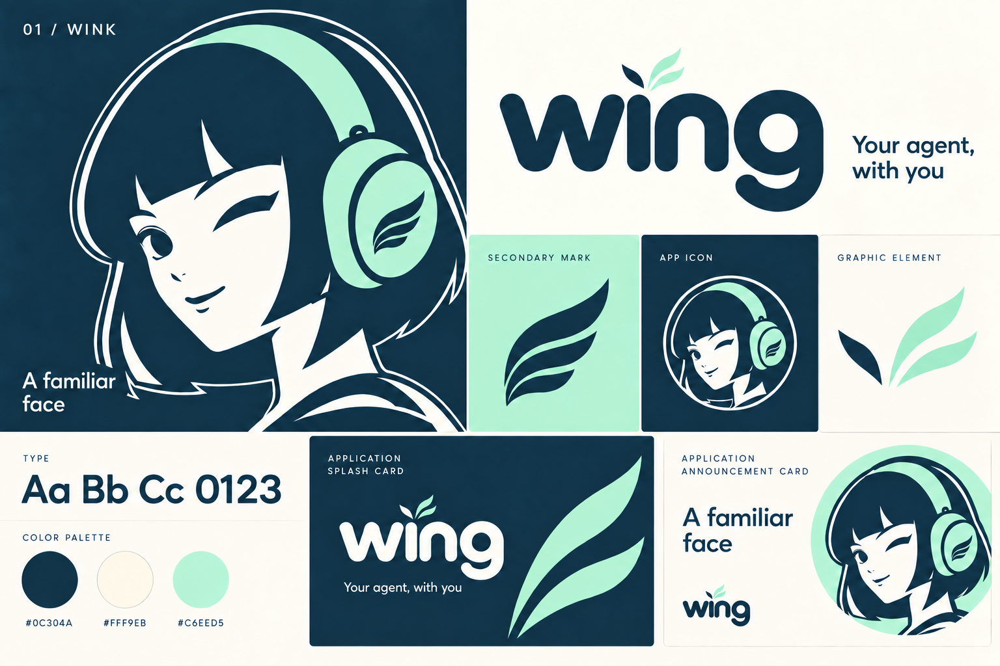

# Wing identity

Approved by the owner on 15 September 2026. This is the selected identity within
the [Studio design system](../DESIGN_SYSTEM.md).

## Name and wordmark

- Write **Wing** in prose, app titles, launcher labels, store listings and accessibility labels. Use **Wing Dev** for development builds.
- The drawn wordmark is lowercase **wing**, with rounded letters. Keep all four letters; the w is a letter, not a rotated or crossed wing symbol.
- Above the i, use three solid, curved, pointed feather shapes derived from the original single-wing emblem. One small feather points up-left; two point up-right. The left feather is navy on cream and cream on navy. The two right feathers are mint.
- Use the compact accent proportions in this board. The final refinement requested an approximately 18% reduction from the previous cluster and slightly tighter gaps. The accepted image is the visual reference; that percentage is an editing direction, not a measured vector specification.
- Keep visible gaps between feathers and above the i stem. The word should read before the accent draws attention.

## Supporting artwork

Use the same pointed feather silhouettes in standalone graphic elements and
enlarged decorations. The old round-ended splash/droplet accents are retired.
The graphic-element specimen uses the same one-left, two-right arrangement;
the splash card uses the two mint feathers enlarged. Preserve text clearance.

Keep the selected winking portrait, dark bob, mint headphones and original
single-wing earcup emblem. The normal launcher uses the portrait; notifications
and optional themed icons use the existing single wing. See the
[production asset record](2026-09-14-app-icon.md).

| Brand color | Value |
| --- | --- |
| Navy | `#0C304A` |
| Cream | `#FFF9EB` |
| Mint | `#C6EED5` |

These colors belong to the artwork. Studio screen tokens and user accent
preferences continue to govern controls. Rounded lettering and circular portrait
masks remain part of the identity. The board's “Wink” heading is the original
concept name; the product name is Wing. “Your agent, with you” is the selected
tagline, and “A familiar face” is supporting copy. Omit terminal periods from
brand-card and banner copy. Retain the comma in the tagline.

## Source and implementation boundary

The checked-in [board](images/wing-identity-board.png) is the approved raster
design reference. The [final refinement prompt](2026-09-15-wing-identity-prompt.md)
records its generation direction. Earlier experimental boards are unselected.
The board does not identify a verified font family or provide editable vector
wordmark masters. Preserve its drawn letterforms when preparing future assets;
do not substitute a guessed font. Production screens keep Studio typography.

This change adopts the name and saves the visual framework. It does not insert
the entire board into the app or replace existing launcher artwork. Generated
mockups are not evidence of implemented screens or backend capabilities.

## Compatibility and repository rename

Wing is the independent client, previously labelled Hermes Personal. Hermes
Agent remains the server product, so connection, administration and agent-state
references may still say Hermes. Preserve upstream attribution.

Keep the release application ID `com.tarkilhk.hermes.android`, development ID
`com.hermesagent.hermes_android.dev`, signing configuration, notification channel
IDs, storage keys, Dart package `hermes_android` and native namespaces. A display
name change must not create a separate installation or discard existing data.

The repository is still `tarkilhk/hermes-android`. Its rename is a later owner
action. Keep working repository URLs until then. After the rename, update the
Git remote, release/update URLs, workflow references, documentation and store
links, then verify release discovery against the renamed repository. Renaming
the repository does not require changing Android package IDs.
