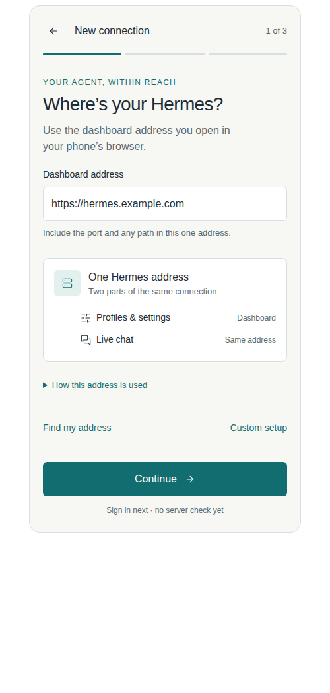
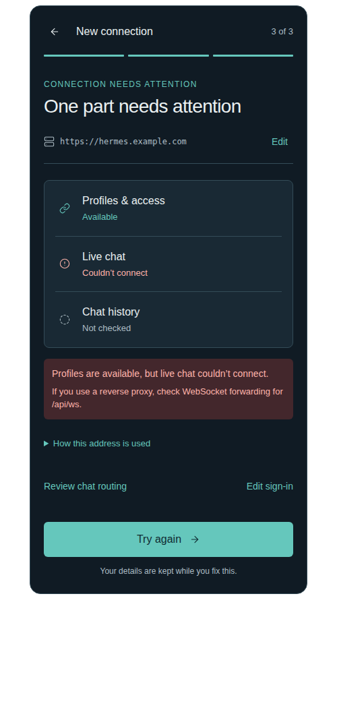

# Add a connection: one address, a clear handshake

**Status:** implemented following owner approval on 16 September 2026. The owner asked for fewer visible options and approved identity artwork. The interactive companion remains a simulated design review; the native app performs actual authenticated checks.

## Implementation refinement

The native flow starts with only the dashboard address and **Find my address**. Sign-in exposes a single **Custom setup** row; proxy authentication, separate chat routing and concealed access-header editing live inside it. Address and verified screens use the approved 112 dp Playful portrait and the wordmark's shared pointed feather paths, with Studio screen/action colors. The initial welcome retains its approved 144 dp portrait.

The implementation uses complete URL parsing, three bounded access checks, explicit final secure save, preserved failed-save drafts, and cancellation that closes provisional HTTP/WebSocket resources. Profile selection stays in the workspace. Errors disclose the failed capability and sanitized status/destination, without raw exceptions or credentials. Endpoint suffixes receive an inline correction explanation; there is no automatic URL rewrite or anonymous-auth mode.

The original proposal below records design rationale, including acceptance criteria for native/device validation. The current user guide is [Getting started](../GETTING_STARTED.md).

## Decision

Make a connection mean **one Hermes installation**, identified by the full address of its dashboard. Replace the small, overloaded dialog with a full-screen, three-step journey:

**Address → Sign in → Check connection → Name and open.**

Normally the same address supplies profiles/settings over HTTP and live chat over a WebSocket. Users should not configure those transports separately. The existing gateway/API vocabulary mixes different Hermes services and makes one ordinary connection appear to require several endpoints.

See the [source investigation](2026-09-16-connection-journey-research.md). This proposal targets the modern authenticated dashboard and Desktop Gateway directly. It does not add old API-server modes, credential fallbacks, compatibility aliases or migration behavior. Existing saved-connection migration is outside this design; any future compatibility proposal needs the owner's explicit approval.

## What an address means

| User's installation | What they enter | What Wing derives |
| --- | --- | --- |
| Dashboard on a private network | `http://hermes.home:9119` | HTTP APIs and `ws://hermes.home:9119/api/ws` |
| Dashboard through an HTTPS proxy | `https://hermes.example.com` | HTTPS APIs on standard port 443 and `wss://hermes.example.com/api/ws` |
| Dashboard under a proxy path | `https://example.com/hermes` | HTTP API routes under `/hermes/api/…` and `/hermes/api/ws` |
| Dashboard on a custom HTTPS port | `https://example.com:8443/hermes` | Both services use port 8443 and preserve `/hermes` |
| Explicitly separate chat gateway | Dashboard URL plus a custom chat base URL | HTTP stays on the dashboard; chat uses the explicitly reviewed override |

These are illustrative addresses, not discovered hosts. A URL without an explicit port uses its scheme's standard port: HTTP 80 or HTTPS 443. Port 9119 is a documented Hermes dashboard default, **not** an implicit replacement for HTTP's port 80. Show it in the local example, never silently append it. The port is never requested twice.

## Journey

### Entry

The approved Wing arrival screen remains the first-connection entry point: portrait, title-case Wing wordmark, tagline and **Connect your agent**. **Restore configuration**, the offline **Connection guide**, and drawer access stay available. This proposal begins when Connect your agent is tapped. Connections → Add connection opens the same journey without repeating the welcome screen.

### 1. Address

**Title:** Where’s your Hermes?

**Body:** Use the dashboard address you open in your phone’s browser.

One labeled field: **Dashboard address**. Example placeholder: `https://hermes.example.com`. URL keyboard, paste support, no autocorrect or capitalization. A local example is available in **Find my address**: `http://hermes.home:9119`.

Below it, the signature connection diagram places one Hermes address above two linked rows: **Profiles & settings** and **Live chat**, captioned **Same address**. It communicates the relationship without teaching API terminology. It expresses intended routing, not reachability. A disclosure, **How this address is used**, shows the resolved full dashboard URL and chat WebSocket URL, including the port and path, for people troubleshooting their setup.

**Continue** performs local validation only. No speculative port scanning, URL discovery or network requests on paste. **Custom setup** opens the exceptional gateway and access-header settings. **Find my address** opens contextual help.

Address rules:

- Require a complete `http://` or `https://` base URL. If the scheme is missing, explain with a concrete example; do not guess a deployment type.
- Preserve an explicit valid port and any path prefix. Remove only a trailing base-URL slash through a visible normalization. Use one source of truth for all subsequent previews and requests.
- Reject credentials embedded in the URL, query strings and fragments with specific correction copy. Do not silently discard them or display their contents in diagnostics.
- If the URL ends in a known endpoint such as `/api/ws` or `/v1/chat/completions`, explain that this field needs the dashboard base. Offer a visible **Use base address** correction for `/api/ws`; do not silently strip arbitrary paths.
- Explain `localhost`, loopback and `0.0.0.0`: “Use your Hermes computer’s address. This address points to this phone or is a listen address.” Do not submit those in the Android journey.
- An HTTP address gets a concise transport note before sign-in: “HTTP does not encrypt this connection. Use a trusted private network or an HTTPS address.” This is contextual information, not an extra confirmation dialog.
- A redirect is not auto-followed with credentials. Recovery asks for the final dashboard URL directly.

### 2. Sign in

**Title:** Sign in to Hermes

The compact destination strip shows the exact dashboard address with **Edit**. Selected method: **Dashboard sign-in**. Username and password are required together. Password starts empty in the product, can be revealed with a labeled control, and supports autofill. Helper: **Use your dashboard login. Model-provider keys stay on Hermes.**

Secondary disclosure: **My access proxy handles sign-in**. This selects a distinct authentication mode, with a tinted selection surface and appropriate screen-reader state. Explain: “For a proxy already configured to authenticate Wing’s requests.” Mere HTTPS or having a reverse proxy does not establish this. Provide access-header editing and a way back to dashboard sign-in. No browser OAuth or SSO capability is implied.

Custom access headers are also available alongside password authentication, because an outer access proxy can coexist with dashboard login. Values are secret, separately labeled, and concealed. Names must be unique ignoring case; app-managed authentication headers cannot be replaced. No field named simply “API key”.

**Check connection** is the primary action. Back retains the draft. Changing address, auth mode, credentials, headers or custom chat URL invalidates prior checks and cancels/ignores stale work.

### 3. Check connection

**Title:** Let’s check the connection

Show three factual stages, matching the real save probe:

1. **Profiles & access** — authenticate and discover available profiles.
2. **Live chat** — establish the authenticated WebSocket and receive gateway readiness.
3. **Chat history** — list sessions for the server-preferred profile used by the current probe.

Each row has a status word: Waiting, Checking, Available, Failed or Not checked. Use a link/status glyph or dot with text, never ticks. A successful earlier stage remains visible when a later one fails. Do not invent progress percentages. Never call the connection successful from `/health`, browser reachability, or a TCP connection alone.

No message is sent and no model response is generated. Successful session enumeration with zero chats is still successful. A session-list error is not an empty history. This is a connection check, not a promise that every profile/model/tool is configured.

Allow **Cancel check**. In the proposed implementation, give each stage a bounded deadline (design starting point: 15 seconds, with a stage-specific Retry). Cancellation closes the provisional socket and prevents late results from advancing or saving. Do not retry automatically with different authentication or a different endpoint.

### 4. Verified, then save

**Title:** Connection verified

Show the destination and a compact summary: **Profiles available · Live chat available · History available**. State **No message sent**. Do not label this “Agent ready”.

Ask for **Connection name** here, after the technical work. Suggest the hostname as editable text; “Home” is an example a user might choose, not a blanket default. Preserve the exact underlying address independently of this label.

Show **Opens with [server-preferred profile display name]**. Use the verified profile result and canonical identity; if only one profile exists, omit a selector. Profile switching belongs in the workspace after opening, rather than expanding this flow into provider/model setup. This does not change the server runtime profile.

Primary action: **Save and open**. Save only at this point; prevent double taps and show **Saving…**. Commit metadata and secure credentials together. If secure save fails, keep the draft and verified state visible with “Couldn’t save this connection on this device” and **Try saving again**. A check is not a saved connection. On success, open Chats for the chosen connection and preferred profile. Leave the existing chat empty state to invite the first message.

Back permits editing. Exiting before save discards an unsaved draft; only ask about discarding if the user actually changed fields. Never persist a half-configured connection. New connection setup does not redirect an already-active workspace before save succeeds.

## Custom setup: exceptional, explicit, reviewable

A dedicated subpage groups **Chat address** and **Access headers**. Path and port remain part of the URL, so no separate “dashboard port” or “path prefix” fields survive in the target form.

Chat address has a clear independent switch: **Use a separate chat address**. Off means the dashboard base URL is authoritative. On reveals **Chat gateway base address**, an HTTP(S) base URL, with this helper: “Only if your administrator gave you a different address for live chat. Wing adds /api/ws.” Do not request a WebSocket URL and then append the route again.

When configured, both addresses appear in the review and diagram; never continue to say “Same address”. Existing auth is connection-scoped, so a different chat origin needs explicit information: “Your dashboard credentials and access headers may be used with this address.” Review both destinations before checking. Do not infer that one host owns another or invent independent gateway credentials.

The auth backend's accepted separate-origin behavior must be verified for the actual installation; an override field alone does not make arbitrary split deployments work. Failure stays attributed to live chat. Advanced settings do not offer compatibility ports, an OpenAI-compatible chat mode, or authentication fallback.

## Recovery language

| Observed result | Visible copy | Primary recovery |
| --- | --- | --- |
| Invalid/missing scheme | “Enter a complete address, such as https://hermes.example.com.” | Correct field inline |
| Name lookup/connect/timeout | “Couldn’t reach this address. Check the address and your phone’s network.” | Edit address; Retry available |
| TLS validation failed | “The server’s certificate couldn’t be verified.” | Edit address; certificate help, no bypass |
| Explicit login rejection | “The dashboard rejected this username or password.” | Edit sign-in |
| Proxy denies request | “Your access proxy denied this request.” only if identified as proxy failure; otherwise “Access was denied.” | Review access settings |
| Redirect response | “This address redirects. Enter the final dashboard address.” | Edit address |
| Missing modern profile contract | “This server doesn’t provide the profile access Wing needs.” | Connection guide; response details |
| Profiles available, chat handshake fails | “Profiles are available, but live chat couldn’t connect.” | Review chat routing; Retry |
| History check fails | “Live chat connected, but chat history couldn’t be loaded.” | Retry history; Details |
| Local save failure | “Couldn’t save this connection on this device.” | Try saving again |

WebSocket recovery says: “If you use a reverse proxy, check WebSocket forwarding for [derived path].” It does not claim a proxy is definitely the cause. **Details** shows the failed stage, sanitized endpoint, HTTP/RPC code if known, and time of check. Never print cookies, passwords, headers, token query values or raw unredacted exceptions. No **Connect anyway** when the required contracts are unverified.

## Visual direction

Use the selected [Studio design charter](../DESIGN_SYSTEM.md), not a new brand theme. The aesthetic risk is making the address itself the central visual object: one source splits cleanly into two capabilities, then the same graphic acquires verified status during the check. This explains the specific product instead of decorating a generic wizard with a large success illustration.

| Token | Light | Dark |
| --- | --- | --- |
| Canvas | `#F7F7F4` | `#101B24` |
| Opaque panel | `#FFFFFF` | `#192934` |
| Main ink | `#1B2D36` | `#EBF1F2` |
| Secondary ink | `#586970` | `#ADBDC4` |
| Teal action | `#126D70` | `#65C7BC` |
| Selected surface | `#E2F1EE` | `#20454A` |

Use the charter's border and on-accent tokens, plus existing semantic error colors. Respect the user's accent family in a future implementation. Roboto owns titles/body; monospace is reserved for endpoint details. Titles 28 sp, body 16 sp, metadata 13 sp. Use 16 dp gutters, 4 dp spacing grid, 6 dp action corners and 8 dp grouped surfaces. No pill-heavy controls, oversized round cards, checkmarks, confetti or glowing status decoration.

The top bar has Back, **New connection**, and **1 of 3** / **2 of 3** / **3 of 3** while appropriate. Address and sign-in are short forms; checking is a grouped status list. The footer action stays easy to reach above keyboard/system insets in the native design. Content scrolls and grows with text, rather than shrinking typography to fit. The interactive review renders the whole mobile surface in normal document flow.

Motion: a single 180–240 ms transition carries the destination strip between steps. During real checks, only the currently pending row indicates activity; resolved stages settle immediately. Reduced motion removes travel/pulse effects and retains status words. No artificial minimum waiting time or looping hero animation.

### Explored and rejected

- **Single long form:** fewer screens, but leaves address, identity, proxy and verification competing for attention. Not selected.
- **Choose LAN / Tailscale / reverse proxy first:** attractive cards, but asks users to classify networking before the app needs that information and invites hidden defaults. Not selected.
- **QR/pairing-first:** appealing future setup, but no verified Hermes pairing contract. Not included in this proposal.
- **Selected:** progressive address/sign-in/check sequence with optional custom settings and specific recovery.

## Accessibility and handoff criteria

- Minimum 48 dp targets; text scales to 200% at 320 dp without clipping fields, stage labels or the primary action. Keyboard can scroll every focused field into view. URL lines wrap or expose their complete value for review.
- Screen-reader headings announce the new step; field errors are associated with their inputs; stage updates announce meaningful transitions once. Focus stays predictable after validation and Back. Password reveal announces its state.
- Selection uses background tint and accessibility semantics, never visual ticks/radio dots. Status includes words and shape so color is not the only cue.
- Test normal HTTPS, local :9119, custom :8443, prefixed paths, bracketed IPv6, malformed URLs, explicit redirects, bad auth, proxy denial, unavailable WebSocket, zero sessions, session failure, cancellation, credential edits during pending work, local persistence failure and stale results after navigation.
- Check light/dark, keyboard-open short screens, 200% text and TalkBack in native widgets before claiming production accessibility. The design review is not native validation.

## Implementation boundary

**Underlying capabilities:** authenticated dashboard/profile access, dashboard-derived WebSocket destination, explicit gateway override, custom headers, profile discovery → gateway connect → session-list probe, and secure credential persistence.

**Implemented journey:** full-URL parsing with standard scheme ports; replace duplicated port/prefix fields; explicit auth selection; a full-screen journey; stage-specific status/errors/deadlines/cancellation; visible derived destinations; review/name after checking; explicit final save. No backend autodiscovery, provisioning, pairing or model-inference test is claimed.

**Design deliverables:** this specification, the cited research note, and the interactive in-conversation review (`connection-journey.html`). The HTML and its original images remain design references. Actual Flutter captures are generated under ignored `build/connection-review/`; no deployed service is changed by the native implementation.

## Preview review

The simulated review was inspected in Chromium. Address → Sign in → Check → Save advanced correctly; custom chat address disclosure and endpoint validation were exercised. Ten design states were measured at 352, 392 and 500 px browser widths without horizontal document/control overflow or JavaScript exceptions. Light entry and dark recovery were visually inspected. This does not establish native keyboard, TalkBack or 200% text behavior; those remain implementation acceptance criteria above. The preview pre-fills illustrative values to make the journey easy to explore; the product starts with empty address and credential fields.

| Light: one address | Dark: specific recovery |
| --- | --- |
|  |  |
